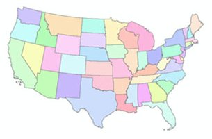
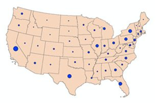
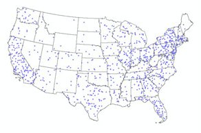
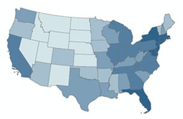
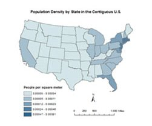

**Learning Objective**

To introduce the principles and techniques of thematic mapping, including dot density, proportional symbol, and choropleth mapping, as well as data classification and basic map design. As a demonstration, you will acquire and map spatial data from the 2010 U.S. Census.

First, complete the tutorial by following the steps below.  Then, using the skills you’ve learned in the tutorial, complete the assignment given following the tutorial.

# TUTORIAL

## Acquire State Population Data from the U.S. Census Bureau

1. In a web browser, navigate to [https://www2.census.gov/geo/tiger/TIGER2010DP1/](https://www2.census.gov/geo/tiger/TIGER2010DP1/).
2. Scroll down and click on 'State_2010Census_DP1.zip' to download.
3. Copy the downloaded zip file into your workspace and unzip it.

View the spatial and attribute data for the State_2010Census_DP1 shapefile in ArcCatalog.

## Convert the Shapefile to NAD 1983 Contiguous USA Albers

In ArcCatalog, use the Project tool in ArcToolbox to create a new shapefile that is in the 'NAD 1983 Contiguous USA Albers' projection and coordinate system.

Call the new shapefile ‘State_2010Census_DP1_Albers’ (you can search for this CRS in the search text box).  Be sure to send the new shapefile to your workspace.

## Select and Export the 48 Contiguous United States

1. Open ArcMap and add the State_2010Census_DP1_Albers shapefile.
2. In ArcMap, select all the objects in the shapefile except the following: Alaska. Hawaii, Puerto Rico, the District of Columbia.  You can do this by opening the attribute table and performing a Select by Attributes operation, through graphical selection, through manual selection, or by some combination.  The Switch Selection button {height="0.167in"}, which reverses the selected and unselected records, may also be useful.
    * There should be 48 states (rows) selected.
3. Export the 48 selected states to a new shapefile by right clicking on the name of the shapefile in the Table of Contents (the window on the left side of ArcMap adjacent to the map itself), going to Data, and then Export Data to open the Export Data dialog box.
    * For Save as type: choose Shapefile.
    * Call the new shapefile 'Contiguous_States' and be sure to send it to your workspace. 
4. Add Contiguous_States to ArcMap and remove the State_2010Census_DP1_Albers shapefile. 
5. Zoom to the Full Extent.

## Explore the Attribute Table

In ArcMap, open the Contiguous_States attribute table and review the field names.

* The `GEOID` field is a unique numeric code for each state used by the U.S. Census Bureau.
* The `STUSPS10` field is the two letter U.S. Postal Service code for the state.
* The `NAME10` field is the name of the state.
* The `ALAND10` field is the land area of the state in square meters.

Note that most field names use a code composed of a set of letters and numbers, e.g. `DP0010001`.

In Microsoft Excel (not ArcGIS), open the Excel file 'DP_Table Descriptions.xls'. Here you will see the definition of each of the field names in the Contiguous_States attribute table.

The fields contain measures of the population of each state, including the total population, and population counts broken down by age, sex, race, Hispanic ethnicity, and household characteristics (e.g. types of families, renters versus home-owners, etc.)

Note two other important fields we will use in the lab assignment:

* The `DP0010001` field is the total population of each state.
* The `DP0100002` field is the Hispanic population of each state.

Return to the Contiguous_States attribute table in ArcMap.

It is often useful to *sort* the table based on a field's values, say, from highest to lowest.

As an example, you will sort the table based on the total population, where states with the highest population will be at the top and those with the lowest at the bottom.

To do this, right click on the total population field (`DP0010001`) and choose 'Sort Descending'.

Note the table is now in the order of states from the highest population (California - 37,253,956 people) to the lowest (Wyoming - 563,626 people).

By repeating this step, this time selecting “Sort Ascending,” you will see Wyoming is now at the top and states are ranked from smallest to largest with respect to population.

## Make an Area-Class Map of the States

1. In ArcMap, in the Table of Contents double-click the Contiguous_States shapefile to open the Layer Properties box.
2. Click on the Symboloby tab if it is not already active. Here, we will assign a unique color to each state.
3. Under 'Show:' choose 'Categories' and 'Unique values'.
4. Under 'Value Field' choose `STUSPS10`.
5. Click the 'Add All Values' button.\
    {height="3in"}\ 
6. Click on the 'OK' button.

You should see a map that looks something like this:

\ 

## Add State Name Labels

Now, we will set our preferences to label each state with its appropriate two letter code.

1. Open the Layer Properties box.
2. Click on the 'Labels' tab.
3. Under 'Text String,' 'Label Field' choose `STUSPS10`.
4. Click on the 'OK' button.

Now, we will display the state code labels.

5. Right-click on the Contiguous_States shapefile in the Table of Contents and go to 'Label Features'.

Labels of the state code (e.g. PA for Pennsylvania) should appear on each state.

## Make a Proportional Symbol Map of Total Population

1. Turn off the Label Features option so the labels do not appear, by right-clicking on the Contiguous_States shapefile in the Table of Contents and unchecking ‘Label Features’.
2. Open the Layer Properties box.
3. Go to the Symbology tab.
4. Under 'Show:' choose 'Quantitites' and 'Proportional Symbols'.
5. Under 'Fields' and 'Value:' choose the field that contains the total population - `DP0010001`.
6. Click on the 'Apply' button (this updates the map but keeps the Layer Properties box open).

You should see a map that looks something like this:

\ 

In the Layer Properties box, you can change the background color, and the size, color, and symbolization of the circles (or other symbol) under the 'Symbol' options by double-clicking on the 'Background' and 'Min Value' items.

Experiment with different background colors, symbol colors, and symbolization to change the look of the map. Cartographers recommend sizing the symbols so that they overlap slightly in the densest part of the map (which for maps of the continental U.S. will usually be the high population density Northeastern states).

## Make a Dot Density Map of Total Population

1. Open the Layer Properties box.
2. Go to the Symbology tab.
3. Under 'Show:' choose 'Quantities' and 'Dot Density'.
4. Under 'Field Selection' choose the field that contains the total population and then click on the '>' button so that the field appears in the text box on the right:\
    {height="3in"}\ 
5. Click on the 'Apply' button (this enables the map but keeps the Layer Properties box open).

You should see a map that looks something like this:

\ 

Note the dots may be faint depending on the color scheme you've chosen (or defaulted).

In the Layer Properties box, you can change the background color, dot size, value, and color.

Experiment with different background, size, value, and color symbolizations to change the look of the map. Make sure the least populous states have two to three dots, and that the dots coalesce in, but don’t completely cover, the most populous states.

## Make a Choropleth Map of Population Density

1. Open the Layer Properties box.
2. Go to the Symbology tab.
3. Under 'Show:' choose 'Quantities' and 'Graduated Colors'.
4. Under 'Fields' and 'Value:' choose the field that contains the total population.

Here, we will map the population density - the total population divided (or "normalized") by the land area of each state.  The population density yields a measure of people per unit area (e.g. people per square mile).  Thus, population density shows the concentration of population, accounting for the fact that given two states with the same total population, if one is much larger in area than the other, the population will be more sparsely distributed on average.

5. To map population density, place total population (`DP0010001`), under “Value”. Under 'Normalization' choose the field that contains the land area of each state - `ALAND10`.  This will map the value of each state's total population divided by its land area (in square meters). The units you see in the map are therefore people per square meter.
6. Under 'Classification' click on the 'Classify' button to bring up the Classification dialog box.
7. Under 'Classification' and 'Method' choose 'Quantile'.

A quantile classification keeps approximately the same number of records (states) in each class regardless of the range of the attribute values.

The dialog box shows you a histogram of population density values.

Break values for the different classes are reported as blue lines in the histogram and in text on the right side of the dialog box. These are generated automatically by the classification method you choose (here, Quantile).

You can also change these manually by dragging the blue lines or entering numbers as text in the Break Values (though this would change the classification scheme from Quantile to Manual).

8. Press the 'OK' button.
9. You can also choose a different color scheme under 'Color Ramp'.  Choose a blue sequential color scheme.
10. Press the 'OK' button.

You should see a map that looks something like this:

\ 

Using the Classification dialog box, experiment with the equal interval and natural breaks data classifications. Note that the classification schemes can represent the underlying data in dramatically different ways.

Experiment with creating your own data classification by manually changing the class break values by grabbing and moving the blue lines shown on the histogram in the Classification dialog box.

For each data classification you choose, note the differences in the class breaks as expressed on the histogram in the Classification dialog box and consequently the changes in the map.

You can also experiment with different Color Ramp options.  Note, however, that only sequential or diverging color schemes are appropriate for continuous data such as population density.

## Design a Map Layout

Once you have created a map of population density with an appropriate data classification and color scheme, you can design a map layout and add other essential elements such as a legend, scale bar, etc. 

1. Switch to Layout View.
2. Go to the 'Insert' menu item at the top toolbar and choose 'Legend' to open the Legend Wizard.
3. Click the 'Next' button for each step of the Legend Wizard until a legend appears.

Note that the legend is a graphic object that can be grabbed and moved, changed in size, etc., as is the map in the Layout View. 

It is also related to the legend in the Table of Contents.  If you change the symbolization in the Data View, the legend will automatically adapt.

For instance, let's change the number of displayed significant digits in the population density to make them easier to read.

4. Open the Layer Properties box.  Right click on the labels and go to 'Format Labels'.\
    {height="3in"}\ 
5. Under 'Rounding' choose 'Number of decimal places' and enter the number 5. 
6. Click the 'OK' button. 
7. Click OK again to close the Layer Properties box.

Notice the change in the both the Table of Contents and the legend.

In order to format the legend properly, it is often easier to break it into smaller graphic pieces. **Note, however, that this also breaks the relation to the legend in the Table of Contents. If you change the layer properties and want the legend to reflect the new symbolization, you will have to delete the graphics-converted legend and add a new legend based on the layer.**

8. Select the legend in the layout, right click on it, and choose 'Convert to Graphics'.\
    {height="4in"}\ 
9. Then, right click on the legend again and choose 'Ungroup'.  This will break the graphic into its graphic and text components.

Double clicking on a text object allows you to edit the text.  Double clicking on a graphic object allows you to edit the color and size of the object.

Certain objects may be further ungrouped. You can select multiple objects and regroup them by right clicking and choosing 'Group'.

Alter the legend so it appears something like this:
 
{height="1in"}\ 

10. Insert a scale bar by going to the 'Insert' menu item and choosing 'Scale Bar'. 
11. Choose the top scale bar option, or you can choose another one if you like.

Like the legend, the scale bar is related to the Data View window - if you change the scale of your map (i.e. zoom in or out), the scale bar will also change automatically.

12. Grab and change the size of the scale bar so that it has a round number (e.g. 1000 miles across).
13. Insert a north arrow by going to the 'Insert' menu item and choosing 'North Arrow'.
14. Choose whichever North Arrow you like and adjust its size.

You can also insert a title by going to the 'Insert' menu item and choosing 'Title'.  Double clicking the title object will allow you to change the font, size, and other text characteristics.

Drawing tools to insert shapes and other graphic objects, and text tools to insert and edit text are also available in the drawing toolbar.  These behave similarly to graphics handling in many other software packages, such as MS Word.

Arrange the legend, scale bar, and north arrow aesthetically and efficiently on the map. A simple and reasonable layout could look something like this:

\ 

You can export your map as an image file so that it can be inserted in other documents, such as a MS Word document or MS Powerpoint presentation or posted to a website.

To export your map go to the 'File' menu item and choose 'Export Map'.

In the Export Map dialog box you can give the image file a path and file name and choose a format.  A common image format is .jpg, though .eps, .png, and other formats are available.  A .jpg resolution of 300 dpi is advisable for use in your lab reports for this course.

# ASSIGNMENT

## Objective

Describe the spatial distribution of the Hispanic population in the contiguous U.S. by state, according to the 2010 U.S. Census.
   
## Deliverables

**Turn in a report in the format described in the syllabus.**

Be sure to include the following information:

1. The five states that have the highest number of Hispanics, and the Hispanic population of each.
2. The five states that have the lowest number of Hispanics, and the Hispanic population of each.
3. The states that have a Hispanic population greater than the total population of the smallest (by population) state in the U.S.
4. A proportional symbol map or a dot density map that shows the distribution of the number of Hispanics in each state.
5. A choropleth map, using a sensible data classification of your choice, that shows the percentage of Hispanics in each state.

The **Introduction** section should state the research objective.

The **Data and Methods** section should state the data sets used in the analysis, from where those data were acquired, the GIS operations employed, and the mapping techniques employed (i.e. state and justify why you chose specific mapping options, such as the type of map, color scheme, the particular data classification for your choropleth map, and so on).

The **Results** section should state the results, i.e. a description of the spatial distribution of Hispanics in the U.S. – where in the U.S. do Hispanics tend to concentrate and where are there few Hispanics? Be sure to include the five pieces of information listed directly above.  The two maps should be cited in the text here (e.g. Figure 1, Figure 2).

The **Discussion** section should interpret your results by briefly interpreting why Hispanics may be concentrated in particular states and regions of the U.S. State the limitations of the analysis (e.g. looking at the state level may not reveal within-state variation in Hispanic population), and how this analysis might be improved (e.g. by examining county level data).

The **Figures and Tables** section should contain the proportional symbol/dot density and choropleth maps, each on a separate page and with a caption.  The maps should be cited in the text.

## Getting Started

All the data and operations you need to complete this assignment are described above.

You will need to identify the field in the attribute table that contains the Hispanic population (it is noted above in this lab document). The field names can be confusing – be sure to carefully select the correct field!

You can use the Sort Descending option in the attribute table to identify the states with the highest and lowest Hispanic population. 

To create a choropleth map of the percent Hispanic population for each state, you can use the Normalization option in the Layer Properties box to map the Hispanic Population / Total Population (which yields the percent of the total population that is Hispanic in each state).
