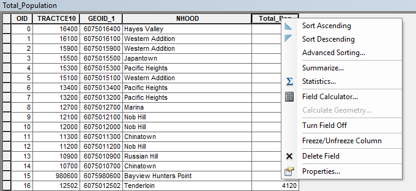
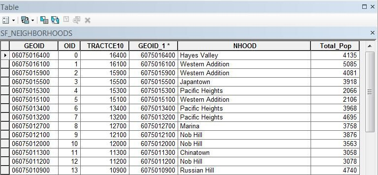
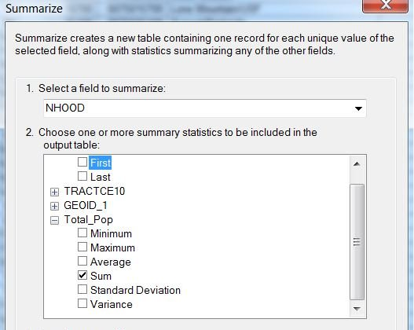
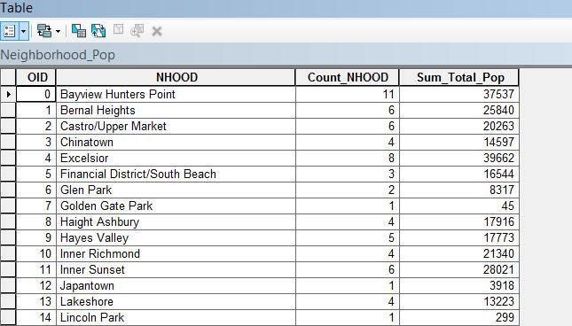
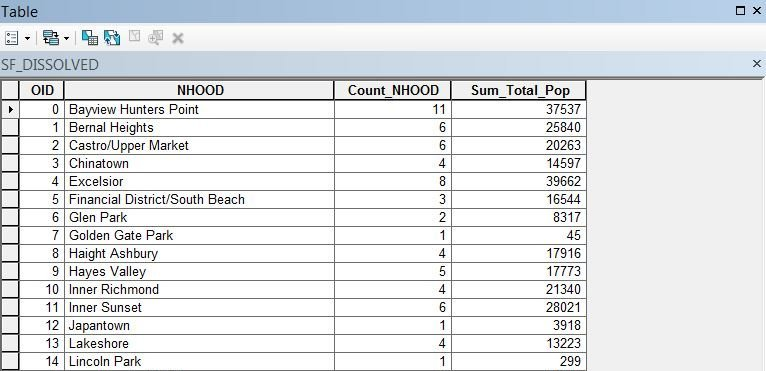
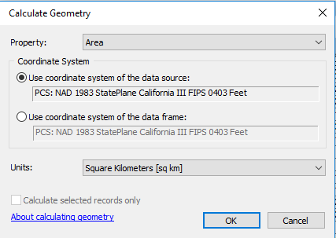
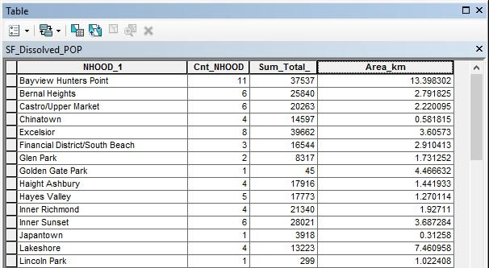

**Learning Objective**

To become familiar with the relational data model, and its
implementation in a GIS software package, including table join, data
export, sorting, summarizing, creating new fields, and calculating
values for fields based on table and geometric calculations. As a
demonstration, you will analyze spatial relationships among data on
census tracts, neighborhoods, crime, and businesses in San Francisco,
California and Chicago, Illinois.

# TUTORIAL

## Acquiring the Data

You are provided the data for this lab in the
[Lab\_4\_tutorial.zip](data/Lab_4_tutorial.zip) file, which includes the
following files:

  - SF\_Tracts is a polygon shapefile representing the US Census Bureau
    tracts in San Francisco. A tract is statistical reporting unit used
    by the US Census Bureau to publish population data (i.e. it does not
    necessarily correspond to political or administrative units like
    cities or wards). The neighborhood assignments in San Francisco
    originally comes from DataSF, San Francisco’s open data portal. The
    data has been manipulated for the purpose of this lab.
  - Total\_Population is a table in dBase format that contains the total
    population of each tract.
  - SF\_Dissolved is a polygon shapefile representing the neighborhoods
    in San Francisco. Neighborhoods are defined as one or more adjacent
    tracts that together compose a named neighborhood.

Move all files to your workspace folder, and unzip any zip files.

## GIS and the Relational Data Model

An attribute table in ArcGIS is composed of records (rows) and fields
(columns):

 

Explore the SF\_tracts and the TOTAL\_POPULATION data sets in
ArcCatalog.

Open ArcMap and add both the SF\_Tracts layer and the Total\_Population
table. In the Table of Contents (TOC), notice that Total\_Population has
a grid icon indicating it is tabular data (with no spatial information)
and the SF\_Tracts layer has an icon indicating it is a polygon spatial
data layer.

 

Right-click on each file in the TOC. You will see that you have
different menu options for tables versus spatial data layers.

### Understanding How Tables Are Organized

1.  In the TOC, right-click on Total\_Population
2.  Select Open
    1.  Draw your attention to the `Total_Pop` field. This field stores
        the total population of each tract according to the 2010 Census.
    2.  Notice also the `NHOOD` field. This field stores the name of the
        neighborhood within which each tract falls, i.e. each
        neighborhood wholly contains one or more census tracts.

<!-- end list -->

3.  At the bottom of the table it should indicate that 0 out of 195
    records (each record is a census tract) are currently selected.  
     

Right-click on the Total\_Pop field name. You should see something like
this:

 

The various options you see are tools you can use to manipulate the data
contained in the field you’ve selected in various ways. For now, explore
the two sorting tools on your own; they’re self-explanatory. Below,
you’ll learn how the Field Calculator, Summarize and Calculate
Geometry tools work.

Close the table.

### Joining a Table to a Spatial Data Layer

Conceptually, a join operation can be understood as adding attributes
(columns) from one table to another based on a common field, such that
the output of a join displays a single table with fields from both
tables. For example, if you have a table with the unemployment rate by
state, and another table with the poverty rate by state, you would join
them to get one table that includes both unemployment rate and poverty
rate by state.

In ArcGIS, the tables that we want to join are referred to as the
**target table** and the **join table**. The target table is the table
that you want new attributes to be added to, and the join table is the
table that is “lending” new attribute fields. In the GIS world, the
target table is almost always a spatial data layer, and the join table
is often a nonspatial table.

To perform a join, a field in each of the tables must be identified that
contains matching values. These **key** fields allow the software to
properly link the records from one table with the analogous records from
the other table. In the target table, the key field must be a **primary
key** or **candidate key** (field that *could* be used as a primary
key). This is a unique field which *identifies* the rows (features) in
the table. For example, a table of US states might have the state name,
two-letter state postal codes, and population. No US state has exactly
the same population, so all of the fields are unique. But you wouldn’t
use the population to *identify* the state. (That is, you wouldn’t say
“I’m going to 37,253,956 this week”, you would say “I’m going to
California.”) You could use either the state name or the postal code,
both of which are unique, as the primary key field.

In the join table, the field must be a **foreign key**, which means a
field with values matching a candidate key in the target table.

Here, we will join the Total\_Population table to the SF\_Tracts spatial
data layer attribute table. Since the Total\_Population is a nonspatial
table, this will allow us to (a) map the total population of each tract,
and (b) generate a population density variable by dividing the total
population by the area of each tract, which we can calculate from the
SF\_Tracts layer.

First, let’s explore our data. Open the SF\_Tracts attribute table. Find
the `GEOID2` field. This field is a unique identifier used by the U.S.
Census Bureau for each tract. No two tracts have the same `GEOID2`
value.

Each field has a specific data type, which indicates the types of values
it can hold. Common data types include text, which holds letters and/or
numbers as text, and numeric data types. Numeric data types include
integers (whole numbers) as well as so-called “floating point” types
such as ‘double,’ and ‘float’.

Right-click on the name of the `GEOID2` field in the table and click on
Properties. Note the data type, which is double (a numeric type).

Now open the Total\_Population table. Find the `GEOID_1` field. This
field is also a unique identifier for each tract. Even though the name
of the field differs from the `GEOID2` field in the SF\_Tracts table, it
contains the same information—a specific tract will have the same value
in each table. These two fields will facilitate the join operation.

Close both tables.

Keep in mind the following information about joins:

1.  Always begin a join operation with the target table (by
    right-clicking on the target table in the TOC).
2.  The key fields in both the target and join table must contain
    similar information.
    1.  They should both refer to the same entity.
    2.  They should both identify each entity using a common value.
    3.  They should be the same data type. Usually this means text or
        integer.
    4.  They do not have to have the same field name (though they can).
        Also, just because they have the same field name doesn’t mean
        they have matching values. In one table a `state` field might
        have state *names*, while in another table a `state` field might
        have state *postal codes*. You *must* become familiar with the
        data you are working with.
    5.  The `OID` or `FID` fields should not generally be used as a join
        field (even though internally they are used as the primary key
        by ArcGIS).

To execute the join operation, in the TOC, right-click on SF\_Tracts
(the target or destination), and select Joins and Relates→Join. Use the
following settings:

1.  In dropdown 1, choose the field `GEOID2` (the key identifying each
    tract in the SF\_Tracts table)
2.  In dropdown 2, choose the Total\_Population table (the join table)
3.  In dropdown 3, choose `GEOID_1` (the foreign key identifying each
    tract in the Total\_Population table).  
     

Press OK. You might be asked if you want to index the join. Choose yes.
On larger data sets the index helps speed processing.

Open up the attribute table in SF\_Tracts and scroll to the right. You
should see that the fields from the Total\_Population table are now
joined to the SF\_Tracts attribute table.

 

Note that while the join is displayed as though the two tables have
become one, the join is not permanent, i.e. the storage of the
SF\_Tracts attribute table has not changed.

To permanently store the SF\_Tracts layer with the joined attributes,
export the layer to a new shapefile. Right-click on SF\_Tracts in the
TOC and choose Data→Export Data. Save as a new shapefile and call it
‘Tract\_Pop’. Add the new shapefile to ArcMap, open the attribute
table, and scroll to the right. You will see that this shapefile
includes the joined attributes – not as a join, but encoded as a part of
the shapefile attribute table.

You can remove a join you no longer need by right-clicking SF\_Tracts in
the TOC, going to Joins and Relates and choosing Remove Join(s).
Sometimes you will perform a join incorrectly—for example, by joining
the tables in the wrong direction; or by selecting fields that don’t
quite match. Since joins don’t modify the data on disk, there is no harm
in creating an incorrect join. Just remove the undesired join and try
again.

## Summarizing and Joining

It is possible to summarize one field by another. This means calculating
summary statistics (such as the sum or average) of a quantitative field
by the unique values in a nominal (categorical) field.\[1\] The
Total\_Population table has population by tract. The field with unique
values that we want to Summarize by is the neighborhoods. We will sum
the total population for the set of tracts in each neighborhood, to
yield the total population of each neighborhood.

The output table from the summarize operation will also show the number
of records summarized for each category, which in this case is the
number of tracts in each neighborhood.

To calculate the total population of each neighborhood:

1.  Open the ‘Total\_Population’ table.
2.  Right-click on the `NHOOD` field and choose Summarize to open the
    Summarize dialog box. Recall that this field is a unique identifier
    of each neighborhood. This is the field we are summarizing on.
3.  The ‘Select a field to summarize:’ box should have `NHOOD` entered
4.  For ‘Choose one or more summary statistics to be included in the
    output table:’ expand the `Total_Pop` field by clicking on the plus
    sign. Click Sum. This indicates that we want the sum of the total
    population for all the tracts that are in the same neighborhood.  
     
5.  For ‘Specify output table’ choose a path to your workspace and the
    file name ‘Neighborhood\_Pop’. Make sure to set the Save as type to
    “dBase Table”. ArcGIS will automatically add the `.dbf` extension.

Add the new table to ArcMap and open it.

 

Notice there are 41 records—one record for each neighborhood.

The `Sum_Total_Pop` field contains the total population of each
neighborhood.

Notice there is a `Count_NHOOD` field that indicates the number of
records in the Total\_Population table that were summed for each record
in the Neighborhood\_Pop table, i.e. the number of tracts in each
neighborhood. For example, there are 11 Census tracts in the Bayview
Hunters Point neighborhood in the Total\_Population table. The
`Sum_Total_Pop` field contains the sum of the populations of those 11
Census tracts. This count field is created automatically by the
summarize operation, and will be useful in the lab assignment.

We will use this new table to map the population density of each
neighborhood. For this, we need a neighborhood spatial data layer.

Add the ‘SF\_Dissolved’ data layer to ArcMap. Each polygon in this layer
is a **neighborhood**—an aggregation of one or more adjacent tracts that
compose a neighborhood.

We can join the Neighborhood\_Pop table to the SF\_Dissolved layer’s
attribute table using `NHOOD` as the join field in both tables, because
they both contain common values that identify each neighborhood.

1.  Right-click on SF\_Dissolved. Select Joins and Relates→Join
    1.  For number 1 choose `NHOOD`.
    2.  For number 2 choose `Neighborhood_Pop`.
    3.  For number 3 choose `NHOOD`.
2.  Click OK.

Check to see if your join was successful by opening the SF\_Dissolved
attribute table and seeing if the `Sum_Total_Pop` field is there and the
population data are displayed.

 

To preserve the join permanently, export the SF\_Dissolved layer to its
own layer and call the new layer SF\_Dissolved\_POP. Add it to ArcMap
and open the attribute table to ensure the join and export worked
properly. Note that when you do the export the field names in the new
data layer will be truncated to 11 characters, so `Sum_Total_Pop` will
be unhelpfully renamed to `Sum_Total_`.

## Calculating Population Density

To calculate population density, we need to find the area of each
neighborhood. We will calculate the area in square kilometers, so that
we can ultimately calculate the population density as people per square
kilometer.

First, we need to create a new field to hold the area value:

1.  Open the attribute table for SF\_Dissolved\_POP.
2.  In the table, click on the Table Options button
     in the upper left hand
    corner of the table and select ‘Add Field’.
3.  Name the field `Area_km` and set the data type to double.

Your attribute table should show your new field as the last entry on the
right side.

To calculate the area of each neighborhood:

1.  Right-click on your new `Area_km` field at the top of the column and
    select ‘Calculate Geometry’. (ArcMap asks you if you would like to
    make changes outside of an edit session—please do so).
2.  Choose square kilometers as your unit of measurement.  
     

Click OK. You should see that the `Area_km` column has been updated with
the calculated values:

 

Now that we have the area of each neighborhood encoded, we can calculate
the population density of each neighborhood:

1.  Add a new field to the SF\_Dissolved\_Pop table, using the double
    data type, and call it `popden` .
2.  Right-click on the new field `popden` at the top of the column and
    choose ‘Field Calculator’ .
3.  Create an equation in the text box where the neighborhood population
    is divided by the neighborhood area:
    1.  Double-click field name that holds the population data:
        `Sum_Total_`
    2.  To the right there will be some operator buttons. Choose the
        division symbol (a forward slash).
    3.  Double-click the field name that holds the area data: `Area_km`.
    4.  The equation `[Sum_Total_] / [Area_km]` should appear in the
        text box.  
          

Click OK. You should see that the `popden` field has been updated with
the calculated values:

 

You have now encoded the population density for each neighborhood in San
Francisco.

Create a choropleth map of population density using the skills you
learned previously.

# ASSIGNMENT

## Objective

You have been hired as a GIS crime analyst for the city of Chicago. Your
boss is upset about how presidential candidates judge your whole city
based on the murder rate. She is also interested in how homicides might
impact tourism in the city.

You have two objectives.

1.  To describe the spatial distribution of the density of homicides by
    police district in Chicago.
2.  To compare the spatial patterns of homicides, Airbnb listings, and
    Airbnb prices in Chicago.

## Deliverables

**Turn in a report in the format described in the syllabus.**

Be sure to include the following information:

1.  A choropleth map that shows the spatial distribution of the density
    of homicides (per square mile) in Chicago by police district,
    displayed in an appropriate UTM coordinate system. **Note:** This
    requires you to change the CRS of the file you are given.
2.  A choropleth map that shows the spatial distribution of the density
    of Airbnb reviews (per square mile) in Chicago by police district,
    displayed in an appropriate UTM coordinate system.
3.  A table that summarizes the average Airbnb price for each police
    district in Chicago.

The **Introduction** section should state the research objective.

The **Data and Methods** section should state the data sets used in the
analysis (only the data used for the assignment), from where those data
were acquired, and the GIS operations employed to investigate the
research objective.

The **Results** section should state the results (i.e. the spatial
distribution of the density of homicides by police district and the
spatial patterns of homicides, Airbnb listings, and Airbnb prices). The
maps and table should be cited in the text here (e.g. Figure 1, Figure
2, Table 1).

The **Discussion** section should state an interpretation of the
results. Consider:

1.  Where are the homicides in Chicago concentrated?
2.  Where are the Airbnb reviews in Chicago concentrated?
3.  Which police districts have the highest average Airbnb prices? Which
    have the lowest?
4.  Is there a relationship, or pattern, between homicides and Airbnb
    reviews and/or prices?
5.  If so, what is the form of this relationship and why might it occur?
6.  The limitations of the analysis, and how the analysis could be
    improved or expanded.

The **Tables and Figures** section should contain the table and maps
noted above, each on a separate page with a caption. The table and maps
should be cited in the text.

## Data

Several data sets are provided to you in the
[Lab\_4\_assignment.zip](data/Lab_4_assignment.zip) file.

  - Police\_Districts\_Chicago is a polygon shapefile of the police
    districts in Chicago. The `DISTRICT` field is a unique number used
    by the police department that identifies each police district. This
    data is from the City of Chicago Data Portal
    (<https://data.cityofchicago.org/>).
  - Selected\_Crimes\_in\_Chicago is a point shapefile of the crime
    incidents in Chicago. The `PRIMARY_DE` field indicates the type of
    crime (i.e. homicides versus other types of crime). The `DISTRICT`
    field is a unique number used by the police department that
    identifies each police district. This data is from the City of
    Chicago Data Portal (<https://data.cityofchicago.org/>).
  - AirBnB\_Data is a point shapefile of the Airbnb listings in Chicago.
    The price field contains the nightly price for the listing. The
    `number_of_` field contains the number of reviews for that listing.
    This data is provided by Inside AirBnb (<http://insideairbnb.com/>).

It is not uncommon for data of unknown location to be geocoded oddly.
For example, many of the points in the crimes layer appear at [Null
Island](https://en.wikipedia.org/wiki/Null_Island). Most likely this
means that when these crimes were reported, the exact location was
unknown, and the database applied a default value of 0° Latitude, 0°
Longitude. Three of the Airbnb properties are at the latitude of
Chicago, but for some reason their longitude is 0° (the Prime Meridian).

For this assignment you can ignore these misplaced features. Use Zoom to
Layer on the police districts layer to zoom the map canvas to our area
of interest. Optionally, you could extract only the features you are
interested in by selecting them in the map canvas, then exporting the
layers to new shapefiles.

## Getting Started

You will need to use several GIS operations you have learned from this
lab and previous labs:

1.  Use operations in projections and coordinate systems to transform
    your data to UTM (research which UTM zone Chicago is in).
2.  Use operations in selection and data export to create a spatial data
    layer of only homicides (not including other crime types).
3.  Use the Summarize operation to calculate the number of homicides and
    Airbnb reviews, and average price, for each police district.
4.  Use the Field Calculator to calculate the density of homicides and
    density of Airbnb reviews for each police district.
5.  Use your thematic mapping skills to create the choropleth maps.

<!-- end list -->

1.  See Bolstad 5e, pp. 39-40 for a refresher on levels of measurement.
